# Features

## 1. Password Confirmation
Includes password confirmation field to ensure users enter their password correctly.

## 2. Form Autofill Disabled
Disables form autofill to prevent browsers from suggesting previously entered values, enhancing security and privacy.

## 3. Client-Side Password Strength Validation
Implements client-side password strength validation to provide feedback to users on the strength of their chosen password.

## 4. Background Image
Utilizes a background image with CSS to enhance visual appeal and create a welcoming atmosphere for the signup page.

## 5. Error Message Display
Displays error messages dynamically below input fields to notify users of any validation errors in real-time.

## 6. Form Submission Prevention
Prevents form submission if validation criteria are not met, ensuring data integrity and preventing incorrect submissions.

## 7. Server-Side Session Management
Stores user credentials (username and password) in PHP session variables for use across multiple pages. This enhances security by keeping sensitive data on the server-side.

## 8. Dynamic User Greeting
Displays the logged-in username dynamically in the navigation bar, providing a personalized experience for the user.

## 9. Background Image Carousel
Incorporates a carousel with background images on the homepage to create visual interest and engage users.

## 10. Responsive Navigation Bar
Utilizes Bootstrap's responsive navigation bar to ensure optimal viewing and navigation experience across devices of all sizes.

## 11. Checkbox-Based Menu Selection
Allows users to select menu items using checkboxes, providing a convenient and intuitive interface for placing orders.

## 12. Reservation Form with Validation
Includes a reservation form with client-side validation for fields such as full name, mobile number, date, and time. This ensures that users provide valid inputs before submitting the form.

## 13. File Upload Feature
Enables users to upload a photo of the restaurant using a file input field. This feature enhances user engagement and allows users to contribute content to the website.

## 14. Review Submission Form
Provides a form for users to submit reviews, allowing them to share their feedback and experiences with the restaurant. This encourages user interaction and contributes to building a sense of community.

## 15. Contact Information and Opening Hours
Displays contact information and opening hours in the footer section, providing users with essential details about the restaurant's operation.

## 16. Custom Favicon
Uses a custom favicon (crown icon) to enhance brand identity and recognition in browser tabs.

## 17. Error Handling and Messaging
Includes error handling and messaging for form validation, ensuring that users receive clear feedback when input errors occur.

## 18. Code Organization and Readability
Maintains clean and organized code structure, making it easy to understand and maintain for future development.

## 19. Footer Section
Adds a footer section with contact information, opening hours, and copyright notice, providing users with additional relevant information and enhancing the website's professional appearance.

# Website Interface
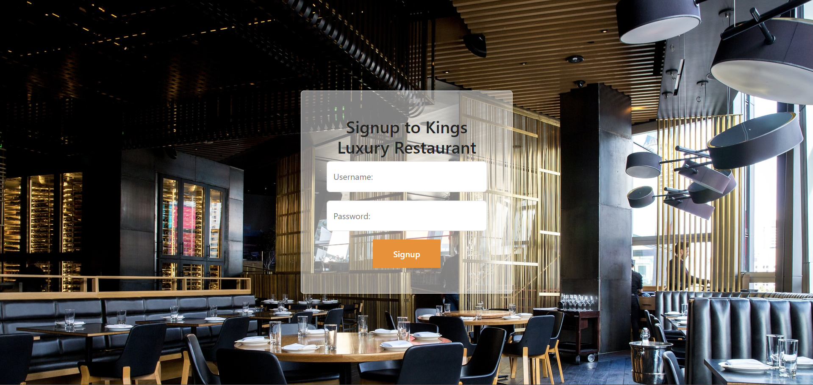
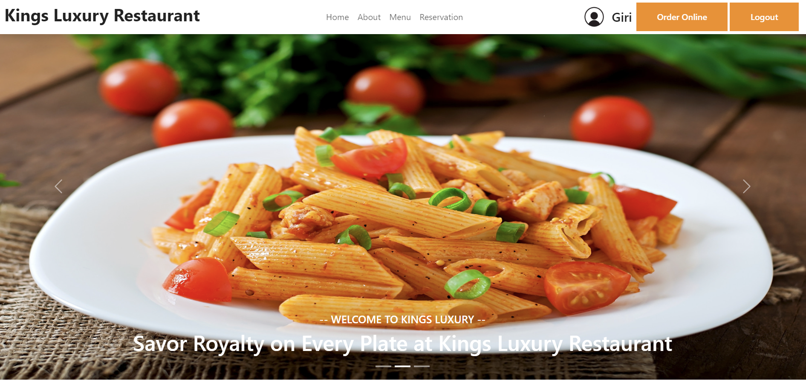
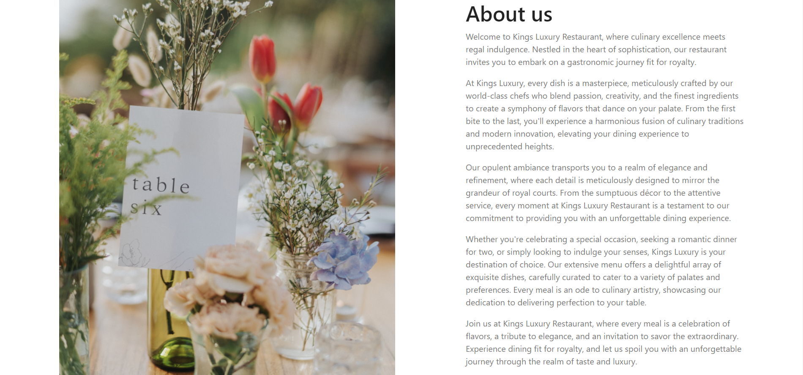
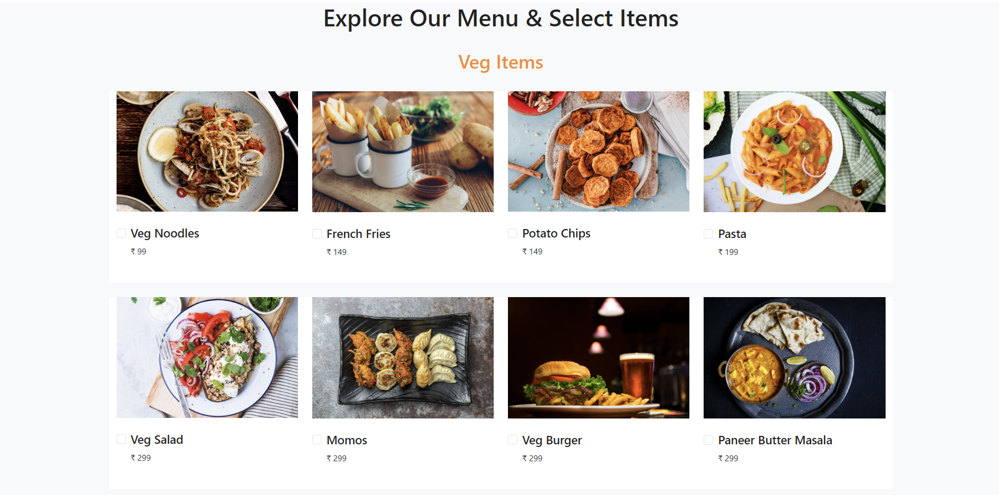
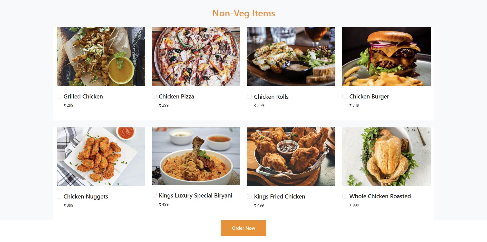
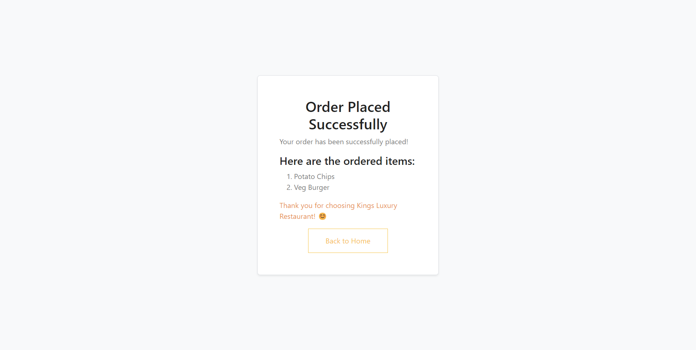
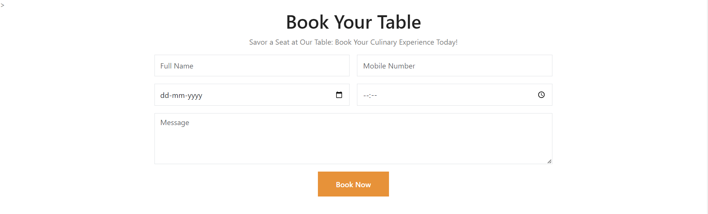
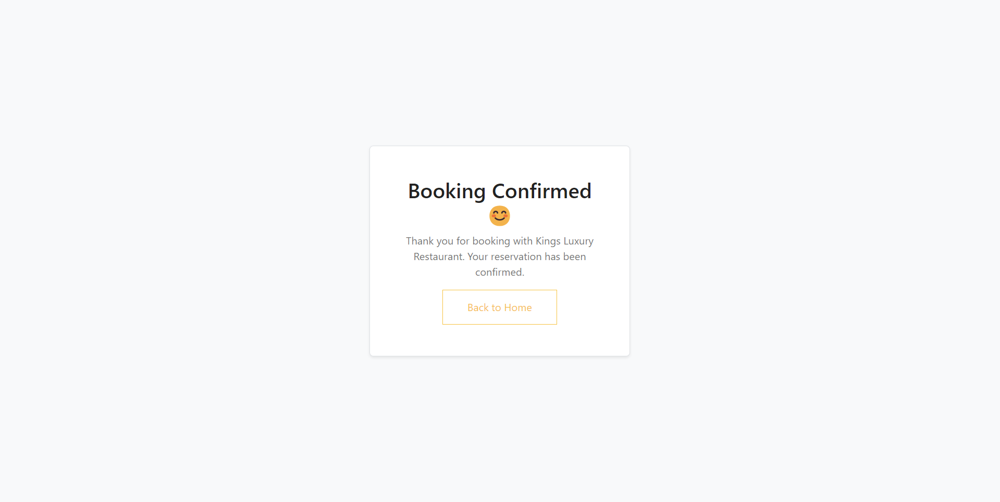

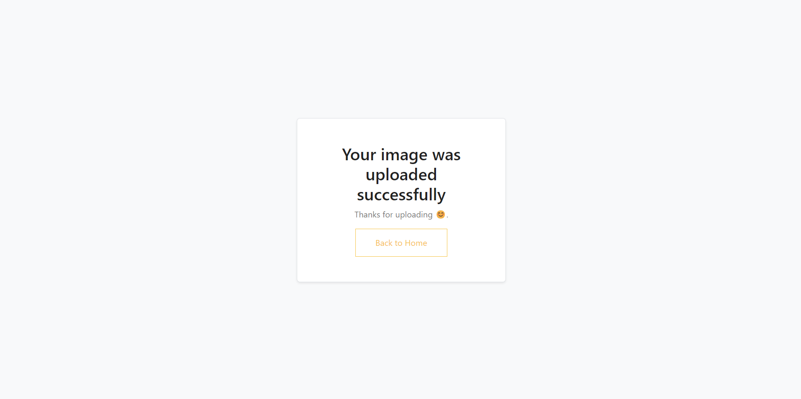

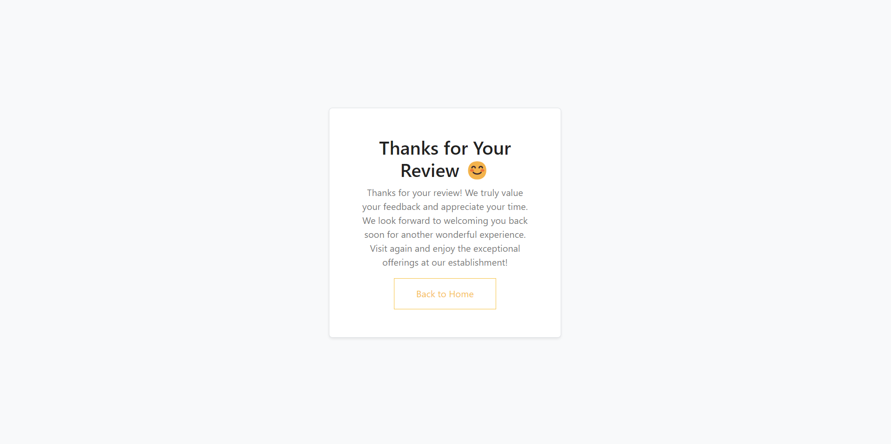
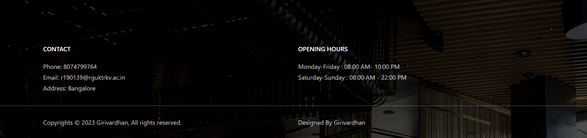
## Credits
### Copyrights © 2023 Girivardhan, All rights reserved.
### Designed By : Girivardhan.
